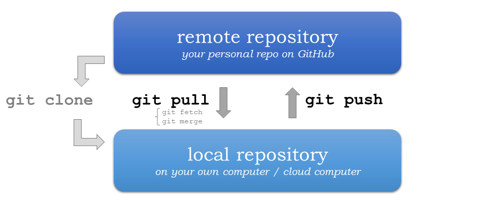
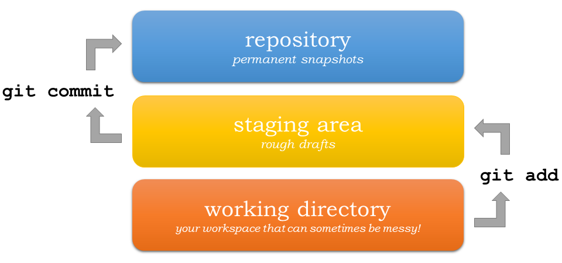
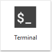

Tutorial 0: Meeting Git
=================================

This tutorial covers the very basics of version control using **Git/GitHub** that we use for programming on this course.

Key concepts
------------

Version control
~~~~~~~~~~~~~~~

We use Git to record changes to our files over time (hence, the name *version control*), and for communicating between the local repository on our computer and the remote repository on GitHub.
A "repository", or a "Git project", or a "repo", is a location for storing files. A repo contains all the files and folders associated with a project and the revision history of each entity.
In general, it is recommended that each project, library or discrete piece of software should have it's own repository.
In this course each exercise has it's own repository on GitHub.

During this course, we often start by cloning an existing repository from GitHub
to our cloud computer (or own computer) using ``git clone``. Using ``git pull`` we can fetch (and merge) new changes from GitHub,
and ``git push`` publishes our local changes to GitHub. Read more about sharing and updating
Git projects `in here <https://git-scm.com/book/en/v2/Appendix-C:-Git-Commands-Sharing-and-Updating-Projects>`__.

    Update your Git project using the pull and push commands. Always pull before you push (especially when working in a shared project)!

Version control history consists of snapshots of all the files in our project.
In order record changes to our files, we first add changes to a so called staging area (using ``git add``). The idea is, that you can have a (sometimes messy) working directory, and by using ``git add`` you tell
Git which files to include in the next committed snapshot. Finally, ``git commit`` records a permanent snapshot of the staged changes. Read more about basic snapshotting `in here <https://git-scm.com/book/en/v2/Appendix-C:-Git-Commands-Basic-Snapshotting>`__.

    Version control steps using Git (adapted from `Git documentation <https://git-scm.com/about/staging-area>`__).

Git from the command line
--------------------------
There are many different ways of using Git, and you might want to try out using Git from the command line at some point.

Terminal
~~~~~~~~~~

.. note::
    You will need to know a couple of basic command line commands in order to use Git from the command line. Code Academy's `list of command line commands <https://www.codecademy.com/articles/command-line-commands>`__ provides
    a good overview of commonly used commands for navigating trough files on the command line. For using Git on the command line, you should at least be familiar with these commands:

    - ``ls`` - list contents of the current directory
    - ``ls -a`` - list contents of the current directory including hidden files
    - ``cd`` - change directory. For example, ``cd exercises``
    - ``cd ..`` - move one directory up

**Start a new Terminal session in JupyterLab** using the icon on the Launcher, or from *File* > *New* > *Terminal*.

**Check if you have git installed** by typing :code:`git --version` in the terminal window:

.. code-block:: bash

    git --version

Anything above version 2 is just fine.

.. note::

    You can paste text on the terminal using :code:`Ctrl + V` or :code:`Shift + Right Click --> paste`

Configuring Git credentials
~~~~~~~~~~~~~~~~~~~~~~~~~~~

Configure Git to remember your identity using the ``git config`` tools. You (hopefully) only need to do this once
if working on your own computer, or on a cloud computer with persistent storage on CSC notebooks.

.. code-block:: bash

    git config --global user.name "[firstname lastname]"
    git config --global user.email "[email@example.com]"

Basic commands
~~~~~~~~~~~~~~
The basic workflow of cloning a repository, adding changes to the staging area, committing and pushing the changes can be completed using these command line commands:

- ``git clone [url]`` - retrieve a repository from a remote location (often from GitHub)
- ``git status``- review the status of your repository (use this command often!)
- ``git add [file]`` - add files to the next commit (add files to the staging area)
- ``git commit -m "[descriptive message]"`` - commit staged files as a new snapshot
- ``git pull`` - bring the local branch up to date (fetch and merge changes from the remote)
- ``git push`` - transmit local branch commits to the remote repository

.. note::

    Remember to use ``git status`` often to check the status of our repository.

.. admonition:: Other useful Git commands

    Check out other commonly used git commands from `the GIT CHEAT SHEET <https://education.github.com/git-cheat-sheet-education.pdf>`__

.. admonition:: Remote repository

    Remote repositories are versions of your project that are hosted on a network location (such as GitHub).
    When we cloned the repository using ``git clone``, Git automatically started tracking the remote repository from where we cloned the project.
    You can use the ``git remote -v`` command to double check which remote your repository is tracking.

    **A common mistake during this course is that you have accidentally cloned the template repository in stead of your own/your teams repository.**

    You can read more about managing remotes `in here <https://git-scm.com/book/en/v2/Git-Basics-Working-with-Remotes>`__.

.. admonition:: Master branch

    **Branches and branching** are powerful features in Git that allow maintaining parallel versions of the same project.
    During this course you don't need to worry too much about branches. However, it is good to understand that **we are working on the master branch of our repository**. For example, when using the ``git push`` command,
    the full syntax is ``git push origin master`` which means that we are pushing the changes to the master branch of the remote repository called origin. Read more about git branches `in here <https://git-scm.com/docs/git-branch>`__.

Resolving conflicts
-------------------

It is possible that you will encounter a **merge conflict** at some point of this course. A merge conflict might happen if two users have edited the same content, or if you
yourself have edited the same content both on GitHub and locally without properly synchronizing the changes. In short, Git will tell you if it is not able to sort out the version history of your project by announcing a merge conflict.

We won't cover how to solve merge conflicts in detail during the lessons. You can read more about `how to resolve merge conflicts from the Git documentation <https://git-scm.com/docs/git-merge#_how_to_resolve_conflicts>`__.
**The best thing to do to avoid merge conflicts is to always Pull before you Push new changes.**
In case you encounter a merge conflict, don't panic! Read carefully the message related to the merge conflict, and try searching for a solution online and ask for help on Slack.

Remember that you can always download your files on your own computer, and upload them manually to GitHub like we did in Exercise 1!

.. figure:: https://imgs.xkcd.com/comics/git.png
    :alt: https://xkcd.com/1597/

    Source: https://xkcd.com/1597/

